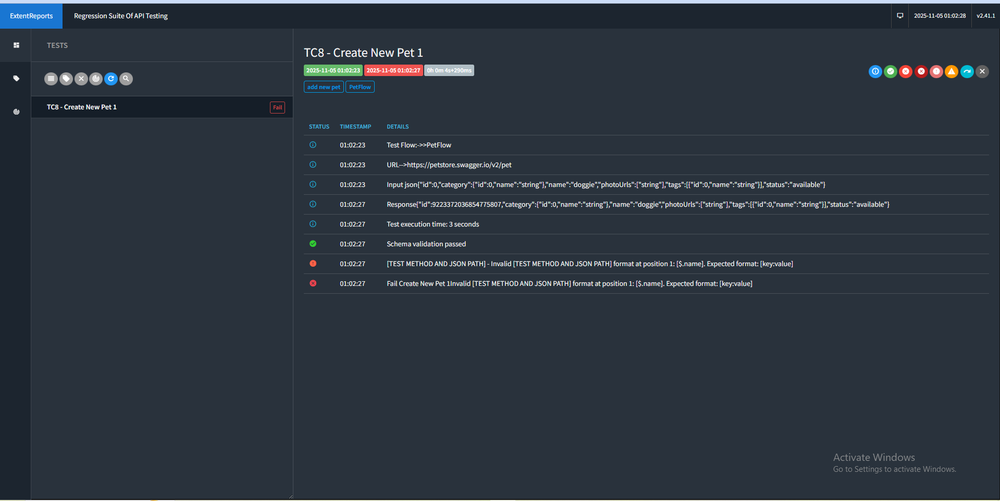

# GENERIC-AUTOMATION-TEST-FOR-API-TESTING


## Data flow
```
┌──────────────────┐
│  Excel Files     │
│  (Test Data)     │
└────────┬─────────┘
         │
         ▼
┌──────────────────┐
│  ApiTestFactory  │ ← @Factory (TestNG)
│  FactoryHelper   │
└────────┬─────────┘
         │
         ▼
┌──────────────────┐
│   DataUtil       │ ← @DataProvider
│  (Đọc Excel)     │
└────────┬─────────┘
         │
         ▼
┌──────────────────┐
│   TestCases      │ ← @Test
│  .testMethod()   │
└────────┬─────────┘
         │
         ▼
┌──────────────────┐
│ GetDynamicData   │
│ Thay thế #, @, epoch
└────────┬─────────┘
         │
         ├──→ Query HSQLDB (cho # và @)
         │
         ├──→ EpochHelper (cho epoch dates)
         │
         ▼
┌──────────────────┐
│RestAssuredHelper │ ← Điều phối
└────────┬─────────┘
         │
         ▼
┌──────────────────┐
│   ApiExecutor    │
│ .apiPost/Get/... │
└────────┬─────────┘
         │
         ├──→ APIExecutorHelper (build URL, headers)
         │
         ├──→ Lưu request (ThreadLocal) ← MỚI! ✨
         │
         ▼
┌──────────────────┐
│  RestAssured     │ ← Thực thi HTTP request
│   (given/when)   │
└────────┬─────────┘
         │
         ▼
┌──────────────────┐
│    Response      │
└────────┬─────────┘
         │
         ├──→ GetJsonValuesFromResponse (trích xuất giá trị)
         │
         ├──→ InMemoryDatabaseHelper (lưu vào HSQLDB)
         │
         ├──→ Assertions (validate)
         │
         ▼
┌──────────────────┐
│  Extent Report   │
│  (HTML output)   │
└────────┬─────────┘
         │
         ├──→ Nếu FAIL: Log cURL ← MỚI! ✨
         │
         ▼
┌──────────────────┐
│    Cleanup       │
│  (@AfterMethod)  │
└──────────────────┘
```
1. Youtube: https://youtu.be/7hKeEioioHo


